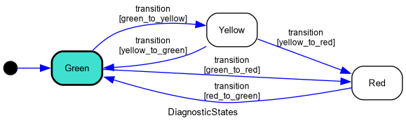
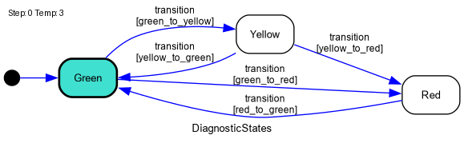
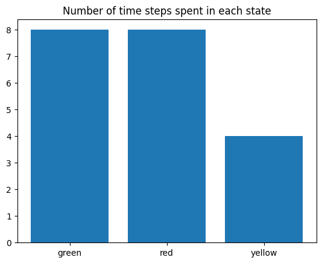

<div id="State-Machine-Simulation" class="section">

# State Machine Simulation[](#State-Machine-Simulation "Link to this heading")

This example shows how to use Python library [python-statemachine](https://python-statemachine.readthedocs.io/en/latest/) to simulate a state machine defined in a SysML file. Since the example is large, we do not show all code inline. To see all files, please download the example [from here](/v0.8.1/examples/state_machine_simulation.zip).

<div id="Running-The-Example" class="section">

## Running The Example[](#Running-The-Example "Link to this heading")

To try the example, please download this Jupyter notebook and accompanying files [from here](/v0.8.1/examples/state_machine_simulation.zip). You should unzip the archive in a folder within the VS Code workspace. To run the example, open `example_notebook.ipynb` file in VS Code. If you have not installed VS Code Python extensions yet, VS Code should prompt you to install them. Follow the installation instructions. Once the extensions are installed, when you open `example_notebook.ipynb` file, VS Code should show “Run All” button at the top of the tab. Click on it to run the example. VS Code may prompt you to install Python packages needed to run Jupyter notebooks, please install them. After installing the dependencies, click on “Run All” button again to run the example.

If VSCode asks you to choose the Python interpreter and you are using a virtual environment, choose the one which includes `.venv` in its path.

<div id="NOTE" class="section">

### NOTE[](#NOTE "Link to this heading")

Before running this example, make sure you have activated the Syside license by running `syside-license check` according to the instructions in the [License Activation](/v0.8.1/automator/install.md) section.

</div>

</div>

<div id="Install-Dependencies" class="section">

## Install Dependencies[](#Install-Dependencies "Link to this heading")

Download [Graphviz](https://www.graphviz.org/download/)

The following command installs the Python packages needed to run this Jupyter notebook. Annotation `%%capture pip` instructs Jupyter to hide the output. To see the output, comment out that line.

<div class="nbinput nblast docutils container">

<div class="prompt highlight-none notranslate">

<div class="highlight">

    [1]:

</div>

</div>

<div class="input_area highlight-ipython3 notranslate">

<div class="highlight">

    %%capture pip
    %pip install -r requirements.txt qq

</div>

</div>

</div>

<div class="nbinput nblast docutils container">

<div class="prompt highlight-none notranslate">

<div class="highlight">

    [2]:

</div>

</div>

<div class="input_area highlight-ipython3 notranslate">

<div class="highlight">

    assert (
        "ERROR" not in pip.stdout  # type: ignore # noqa: F821
    ), f"Installation of PIP packages failed:\n{pip.stdout}"  # type: ignore # noqa: F821

</div>

</div>

</div>

Import all dependencies needed for the example.

<div class="nbinput nblast docutils container">

<div class="prompt highlight-none notranslate">

<div class="highlight">

    [3]:

</div>

</div>

<div class="input_area highlight-ipython3 notranslate">

<div class="highlight">

    import syside
    import base64
    import pathlib
    import os
    import imageio
    import numpy as np
    import pandas
    import matplotlib.pyplot as plt
    from IPython.display import Markdown, display
    from collections import Counter
    from sm_helpers import (
        StateMachine,
        render_state_machine,
        render_graph_to_file,
        sensor_readings_generator,
    )
    from syside_helpers import (
        get_node,
        set_feature_value,
        pprint_sysml,
    )

</div>

</div>

</div>

</div>

<div id="Model" class="section">

## Model[](#Model "Link to this heading")

<div class="nbinput nblast docutils container">

<div class="prompt highlight-none notranslate">

<div class="highlight">

    [4]:

</div>

</div>

<div class="input_area highlight-ipython3 notranslate">

<div class="highlight">

    MODEL = "example_model.sysml"
    EXAMPLE_DIR = pathlib.Path(os.getcwd())
    MODEL_FILE_PATH = EXAMPLE_DIR / MODEL
    
    (model, diagnostics) = syside.load_model([MODEL_FILE_PATH])
    assert not diagnostics.contains_errors(warnings_as_errors=True)

</div>

</div>

</div>

In this example, we model the alarm system of a fridge that is supposed to inform the user when they forgot to close the fridge door and the temperature in the fridge raises to a level that poses a risk of food getting bad. We model the alarm system as a state machine with three states:

<div class="nbinput docutils container">

<div class="prompt highlight-none notranslate">

<div class="highlight">

    [5]:

</div>

</div>

<div class="input_area highlight-ipython3 notranslate">

<div class="highlight">

    lines = []
    for state in model.nodes(syside.StateUsage):
        state_documentation = " ".join(
            documentation.body for documentation in state.documentation.collect()
        )
        lines.append(f"- State {state.declared_name}: {state_documentation}")
    display(Markdown("\n".join(lines)))

</div>

</div>

</div>

<div class="nboutput nblast docutils container">

<div class="prompt empty docutils container">

</div>

<div class="output_area docutils container">

  - State green: The temperature in the fridge is as expected.

  - State yellow: The temperature in the fridge is too high, but not critical yet.

  - State red: The temperature in the fridge is critical, the food is going to get bad.

</div>

</div>

The transitions between these states are guarded by the values of the temperature sensor:

<div class="nbinput docutils container">

<div class="prompt highlight-none notranslate">

<div class="highlight">

    [6]:

</div>

</div>

<div class="input_area highlight-ipython3 notranslate">

<div class="highlight">

    lines = []
    for transition in model.nodes(syside.TransitionUsage):
        trigger = transition.trigger_action
        assert trigger
        payload = trigger.payload_argument
        assert payload
        guard = pprint_sysml(payload.children[0][1])
        source, target = transition.source, transition.target
        assert source
        assert target
        lines.append(
            f"- Transition from {source.declared_name} to {target.declared_name} with guard: `{guard}`"
        )
    display(Markdown("\n".join(lines)))

</div>

</div>

</div>

<div class="nboutput nblast docutils container">

<div class="prompt empty docutils container">

</div>

<div class="output_area docutils container">

  - Transition from green to yellow with guard: `readSensors.temp >= YellowThreshold and readSensors.temp < RedThreshold`

  - Transition from green to red with guard: `readSensors.temp >= RedThreshold`

  - Transition from yellow to green with guard: `readSensors.temp < YellowThreshold`

  - Transition from yellow to red with guard: `readSensors.temp >= RedThreshold`

  - Transition from red to green with guard: `readSensors.temp < YellowThreshold`

</div>

</div>

`RedThreshold` and `YellowThreshold` are constants defined in the model:

<div class="nbinput docutils container">

<div class="prompt highlight-none notranslate">

<div class="highlight">

    [7]:

</div>

</div>

<div class="input_area highlight-ipython3 notranslate">

<div class="highlight">

    display(
        Markdown(
            f"""
    ```
    {pprint_sysml(get_node(model, ["Demo", "Fridge_Signals", "YellowThreshold"]))}
    {pprint_sysml(get_node(model, ["Demo", "Fridge_Signals", "RedThreshold"]))}
    ```
    """
        )
    )

</div>

</div>

</div>

<div class="nboutput nblast docutils container">

<div class="prompt empty docutils container">

</div>

<div class="output_area docutils container">

<div class="highlight-none notranslate">

<div class="highlight">

    attribute YellowThreshold = 6;
    
    attribute RedThreshold = 9;

</div>

</div>

</div>

</div>

While `readSensors.temp` is a result of an action:

<div class="nbinput docutils container">

<div class="prompt highlight-none notranslate">

<div class="highlight">

    [8]:

</div>

</div>

<div class="input_area highlight-ipython3 notranslate">

<div class="highlight">

    display(
        Markdown(
            f"""
    ```
    {pprint_sysml(get_node(model, ["Demo", "Fridge_Actions", "readSensors"]))}
    ```
    """
        )
    )

</div>

</div>

</div>

<div class="nboutput nblast docutils container">

<div class="prompt empty docutils container">

</div>

<div class="output_area docutils container">

<div class="highlight-none notranslate">

<div class="highlight">

    action readSensors {
      out temp : Integer;
    }

</div>

</div>

</div>

</div>

In file `sm_helpers.py` ([download archive](/v0.8.1/examples/state_machine_simulation.zip)), we provide a class `StateMachine` that enables us to convert a SysML state machine to a state machine based on Python library [python-statemachine](https://python-statemachine.readthedocs.io/en/latest/). Class `StateMachine` is instantiated by giving it the SysML element that represents the state machine, which in our case has the qualified name `Demo::Fridge_Diagnostic::DiagnosticStates`. To retrieve this element we use the helper function `get_node` defined in file `syside_helpers.py`.

<div class="nbinput nblast docutils container">

<div class="prompt highlight-none notranslate">

<div class="highlight">

    [9]:

</div>

</div>

<div class="input_area highlight-ipython3 notranslate">

<div class="highlight">

    state_machine_node = get_node(
        model, ["Demo", "Fridge_Diagnostic", "DiagnosticStates"]
    ).cast(syside.StateDefinition)
    state_machine = StateMachine(model, state_machine_node)
    py_state_machine = state_machine.create_python_state_machine(
        allow_event_without_transition=True
    )

</div>

</div>

</div>

One feature provided by `python-statemachine` is rendering of state machines using graphviz:

<div class="nbinput docutils container">

<div class="prompt highlight-none notranslate">

<div class="highlight">

    [10]:

</div>

</div>

<div class="input_area highlight-ipython3 notranslate">

<div class="highlight">

    render_state_machine(py_state_machine)

</div>

</div>

</div>

<div class="nboutput nblast docutils container">

<div class="prompt highlight-none notranslate">

<div class="highlight">

    [10]:

</div>

</div>

<div class="output_area docutils container">



</div>

</div>

</div>

<div id="Simulation" class="section">

## Simulation[](#Simulation "Link to this heading")

Converting the state machine to Python also enables us to execute it on sample inputs. Our state machine has one input parameter of type `int` `Demo::Fridge_Actions::readSensors::temp`. We defined function `sensor_readings_generator`, which generates a sequence of random temperature readings. For example:

<div class="nbinput docutils container">

<div class="prompt highlight-none notranslate">

<div class="highlight">

    [11]:

</div>

</div>

<div class="input_area highlight-ipython3 notranslate">

<div class="highlight">

    list(sensor_readings_generator(seed=123, count=3))

</div>

</div>

</div>

<div class="nboutput nblast docutils container">

<div class="prompt highlight-none notranslate">

<div class="highlight">

    [11]:

</div>

</div>

<div class="output_area docutils container">

<div class="highlight">

    [{('Demo', 'Fridge_Actions', 'readSensors', 'temp'): 3},
     {('Demo', 'Fridge_Actions', 'readSensors', 'temp'): 2},
     {('Demo', 'Fridge_Actions', 'readSensors', 'temp'): 7}]

</div>

</div>

</div>

To execute the state machine, we have to evaluate the transition guards. We evaluate a transition guard in two steps. First, we set the value of `readSensors.temp` to the one we received from our random reading generator, which makes the guard statically evaluatable:

<div class="nbinput docutils container">

<div class="prompt highlight-none notranslate">

<div class="highlight">

    [12]:

</div>

</div>

<div class="input_area highlight-ipython3 notranslate">

<div class="highlight">

    set_feature_value(model, ("Demo", "Fridge_Actions", "readSensors", "temp"), 1)
    display(
        Markdown(
            f"""
    ```
    {pprint_sysml(get_node(model, ["Demo", "Fridge_Actions", "readSensors"]))}
    ```
    """
        )
    )

</div>

</div>

</div>

<div class="nboutput nblast docutils container">

<div class="prompt empty docutils container">

</div>

<div class="output_area docutils container">

<div class="highlight-none notranslate">

<div class="highlight">

    action readSensors {
      out temp : Integer = 1;
    }

</div>

</div>

</div>

</div>

Second, we use the constant evaluator `syside.Compiler` to evaluate the value of the guard:

<div class="nbinput docutils container">

<div class="prompt highlight-none notranslate">

<div class="highlight">

    [13]:

</div>

</div>

<div class="input_area highlight-ipython3 notranslate">

<div class="highlight">

    compiler = syside.Compiler()
    first_transition = list(model.nodes(syside.TransitionUsage))[0]
    trigger = first_transition.trigger_action
    assert trigger
    payload = trigger.payload_argument
    assert payload
    expression = (
        payload.children[0][1].cast(syside.Feature).feature_value_expression
    )
    assert expression
    value, report = compiler.evaluate(expression)
    assert not report.fatal, str(report.diagnostics)
    display(
        Markdown(
            f"""
    Guard `{pprint_sysml(expression)}` evaluates to `{value}`.
    """
        )
    )

</div>

</div>

</div>

<div class="nboutput nblast docutils container">

<div class="prompt empty docutils container">

</div>

<div class="output_area docutils container">

Guard `readSensors.temp >= YellowThreshold and readSensors.temp < RedThreshold` evaluates to `False`.

</div>

</div>

With these building blocks we can simulate how our state machine behaves on a sequence of random temperature readings generated by `sensor_readings_generator`.

The following code snippet executes the state machine on 20 randomly generated inputs, logs each input and the resulting state, and renders the state of the machine as a PNG image. The evaluation of transition guards is hidden inside the implementation of class `StateMachine`.

<div class="nbinput nblast docutils container">

<div class="prompt highlight-none notranslate">

<div class="highlight">

    [14]:

</div>

</div>

<div class="input_area highlight-ipython3 notranslate">

<div class="highlight">

    from PIL import Image, ImageDraw
    
    state_list = []
    sensor_values = []
    image_paths = []
    for step, sensor_value in enumerate(sensor_readings_generator(123, 20)):
        sensor_values.append(sensor_value)
        py_state_machine.send("transition", sensor_value)
        state_list.append(py_state_machine.current_state_value)
        image_path = f"fridge_state_{step:02}.png"
        render_graph_to_file(py_state_machine, image_path)
        image = Image.open(image_path)
        draw = ImageDraw.Draw(image)
        text_color = (0, 0, 0)  # Black
        text_position = (10, 10)
        draw.text(
            text_position,
            f"Step: {step} Temp: {sensor_value[('Demo', 'Fridge_Actions', 'readSensors', 'temp')]}",
            fill=text_color,
        )
        image.save(image_path)
        image_paths.append(image_path)

</div>

</div>

</div>

Now, we can convert the generated PNG images into a GIF to get a simple animation that shows the execution of the state machine (note that generating a GIF is just one of many ways to create animations in Jupyter notebooks, for example, )

<div class="nbinput docutils container">

<div class="prompt highlight-none notranslate">

<div class="highlight">

    [ ]:

</div>

</div>

<div class="input_area highlight-ipython3 notranslate">

<div class="highlight">

    GIF_FILE = "fridge_state_animation.gif"
    with imageio.get_writer(GIF_FILE, mode="I", duration=1000, loop=0) as writer:
        for png_file in image_paths:
            data = imageio.v3.imread(png_file)
            writer.append_data(data)  # type: ignore
    with open(GIF_FILE, "rb") as f:
        file_content = f.read()
    base64_encoded_gif = base64.b64encode(file_content).decode("utf-8")
    display(
        Markdown(
            f""
        )
    )

</div>

</div>

</div>

<div class="nboutput nblast docutils container">

<div class="prompt empty docutils container">

</div>

<div class="output_area docutils container">



</div>

</div>

In addition to visually seeing how the state machine executes, we can analyze in which states it spent most of its time.

<div class="nbinput docutils container">

<div class="prompt highlight-none notranslate">

<div class="highlight">

    [16]:

</div>

</div>

<div class="input_area highlight-ipython3 notranslate">

<div class="highlight">

    state_counts = Counter(state_list)
    common = state_counts.most_common()
    labels = [item[0] for item in common]
    number = [item[1] for item in common]
    plt.bar(np.arange(len(common)), number, tick_label=labels)
    plt.title("Number of time steps spent in each state")
    plt.show()

</div>

</div>

</div>

<div class="nboutput nblast docutils container">

<div class="prompt empty docutils container">

</div>

<div class="output_area docutils container">



</div>

</div>

As we can see from the barchart, the state machine spent most of its time in red state, which means that most of its time the fridge alarm was beeping, which is potentially an undesired behavior.

To understand why this the red state is so prominent, we can look at the detailed log:

<div class="nbinput docutils container">

<div class="prompt highlight-none notranslate">

<div class="highlight">

    [17]:

</div>

</div>

<div class="input_area highlight-ipython3 notranslate">

<div class="highlight">

    pandas.DataFrame(
        [
            dict(sensor_value, state=state)
            for (sensor_value, state) in zip(sensor_values, state_list)
        ]
    )

</div>

</div>

</div>

<div class="nboutput nblast docutils container">

<div class="prompt highlight-none notranslate">

<div class="highlight">

    [17]:

</div>

</div>

<div class="output_area rendered_html docutils container">

<div>

|    | (Demo, Fridge\_Actions, readSensors, temp) | state  |
| -- | ------------------------------------------ | ------ |
| 0  | 3                                          | green  |
| 1  | 2                                          | green  |
| 2  | 7                                          | yellow |
| 3  | 8                                          | yellow |
| 4  | 7                                          | yellow |
| 5  | 3                                          | green  |
| 6  | 1                                          | green  |
| 7  | 4                                          | green  |
| 8  | 9                                          | red    |
| 9  | 12                                         | red    |
| 10 | 12                                         | red    |
| 11 | 12                                         | red    |
| 12 | 7                                          | red    |
| 13 | 4                                          | green  |
| 14 | 3                                          | green  |
| 15 | 6                                          | yellow |
| 16 | 9                                          | red    |
| 17 | 9                                          | red    |
| 18 | 7                                          | red    |
| 19 | 4                                          | green  |

</div>

</div>

</div>

From the log we can see that we have periods of time when the temperature does not rise anymore and eventually starts dropping, but the state machine still stays in red state signaling that the fridge user should do something even though they potentially already closed the fridge door. Therefore, from this simulation we can see that our state machine that only relies on temperature readings is not good enough and probably we should also take into account whether the fridge door is open or not.

We leave it as exercise to the reader to experiment improving the model.

</div>

<div id="Download" class="section">

## Download[](#Download "Link to this heading")

Download this example [here](/v0.8.1/examples/state_machine_simulation.zip).

</div>

</div>
